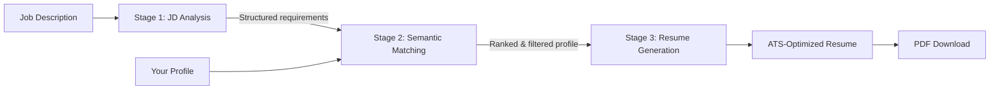

# OpenResume — AI-Powered Tailored Resume Generator

Generate ATS-optimized resumes tailored to specific job descriptions using a 3-stage AI pipeline with semantic matching.

[](LICENSE)
[](docker-compose.yml)
[](pulls)
[](https://www.python.org/)
[](https://react.dev/)

---

## Features

- **3-Stage AI Pipeline** — JD Analysis → Semantic Embedding Match → ATS-Optimized Generation
- **Multi-Provider AI** — Google Gemini, Gemma, OpenAI GPT, Anthropic Claude, and local Ollama models
- **First-Time Onboarding** — Guided setup wizard walks new users through API key configuration on first launch
- **Resume Import** — Paste text or upload a PDF/DOCX to auto-fill your profile with AI parsing
- **Profile Management** — Store and edit personal info, experience, education, skills, projects, and certifications
- **Job URL Scraping** — Paste a job description or provide a URL (LinkedIn, etc.) to auto-extract requirements
- **ATS Optimization** — Keyword-optimized resumes with quantifiable achievements that pass applicant tracking systems
- **PDF Export** — Download clean, professional, ATS-friendly PDF resumes
- **Resume History** — Track, preview, re-download, or delete previously generated resumes
- **Settings Dashboard** — Configure API keys, manage AI models (add/remove/hide), set defaults, view Ollama connection status
- **Local-First Option** — Run entirely with local Ollama models for complete privacy

## Architecture

The resume generation uses a 3-stage pipeline for maximum relevance and ATS compatibility:



| Stage | What happens | Model |
|-------|-------------|-------|
| **1. JD Analysis** | Extracts skills, responsibilities, keywords, seniority from the job description | Cloud LLM (Gemini / GPT / Claude) |
| **2. Semantic Matching** | Embeds JD requirements and profile items, ranks by cosine similarity, filters top matches | Local Ollama (`nomic-embed-text`) |
| **3. Resume Generation** | Generates a tailored, keyword-saturated, ATS-optimized resume from the ranked profile | Cloud LLM (or local Ollama) |

> If Ollama is not available, Stage 2 is skipped and the full profile is passed directly to Stage 3.

## Screenshots

<!-- Add screenshots of your app here before publishing -->
<!-- Example: -->
<!--  -->
<!--  -->
<!--  -->

*Screenshots coming soon.*

## Tech Stack

| Layer | Technologies |
|-------|-------------|
| **Backend** | Python 3.10+, FastAPI, SQLAlchemy, SQLite, LiteLLM, fpdf2 |
| **Frontend** | React 19, TypeScript, Vite, TailwindCSS 4, React Router, Axios |
| **AI Providers** | Google Gemini, Gemma 3 (27B/12B/4B), OpenAI, Anthropic (via LiteLLM) |
| **Local AI** | Ollama — embeddings (`nomic-embed-text`) and generation (`mistral`, `llama3.1`, `gemma2`) |

## Getting Started

### Quick Start (Docker)

The fastest way to run OpenResume. Requires only [Docker](https://docs.docker.com/get-docker/).

```bash
git clone https://github.com/navneet-singh-sengar/open-resume
cd open_resume
docker compose up --build
```

Open **http://localhost:3000** in your browser. That's it.

No API keys are needed to start -- a guided onboarding wizard will walk you through setup on first visit.

> To stop: `Ctrl+C` or `docker compose down`. Your data is persisted in a Docker volume.

### Development Setup (Manual)

For contributors or if you prefer running without Docker.

**Prerequisites:** Python 3.10+, Node.js 18+

```bash
# Backend
cd backend
python3 -m venv venv
source venv/bin/activate   # On Windows: venv\Scripts\activate
pip install -r requirements.txt
cp .env.example .env       # Edit .env with your API keys (see Configuration below)
uvicorn app.main:app --reload --port 8000

# Frontend (in a separate terminal)
cd frontend
npm install
npm run dev
```

Open **http://localhost:5173** in your browser.

### Ollama Setup (Optional)

Ollama provides local embeddings for semantic matching and local model inference. Without it, the app still works but skips the relevance-ranking stage.

```bash
# Install Ollama (macOS)
brew install ollama

# Start the server
ollama serve

# Pull the embedding model (in a separate terminal)
ollama pull nomic-embed-text

# Optional: pull a local generation model
ollama pull mistral
```

> When using Docker, Ollama runs on your host machine and the backend connects to it automatically via `host.docker.internal`.

## Configuration

Create a `.env` file in the `backend/` directory (or copy from `.env.example`):

| Variable | Description | Required |
|----------|-------------|----------|
| `GEMINI_API_KEY` | Google Gemini API key ([get one](https://aistudio.google.com/apikey)) | For Gemini models |
| `OPENAI_API_KEY` | OpenAI API key ([get one](https://platform.openai.com/api-keys)) | For GPT models |
| `ANTHROPIC_API_KEY` | Anthropic API key ([get one](https://console.anthropic.com/settings/keys)) | For Claude models |
| `DEFAULT_MODEL` | Default AI model (e.g. `gemini/gemini-3-flash-preview`) | No (defaults to Gemini 3 Flash) |
| `DATABASE_URL` | SQLite database path | No (defaults to `sqlite:///./open_resume.db`) |
| `OLLAMA_BASE_URL` | Ollama server URL | No (defaults to `http://localhost:11434`) |
| `EMBEDDING_MODEL` | Ollama embedding model | No (defaults to `nomic-embed-text`) |

> You only need the API key for the provider(s) you plan to use. API keys can also be configured at runtime from the **Settings** page in the UI.

## Usage

1. **Set up** — On first launch, the onboarding wizard guides you through adding an API key (Google Gemini is free). You can skip this if using local Ollama models only.

2. **Import your resume** — On the Profile page, use "Import from Resume" to paste text or upload a PDF/DOCX. AI will parse and fill your profile automatically.

3. **Review your profile** — Edit personal info, experience, education, skills, projects, and certifications as needed.

4. **Generate a tailored resume** — Go to the Generate page, paste a job description or provide a job URL, select an AI model, and click Generate.

5. **Download** — Preview the tailored resume and download it as a clean PDF.

6. **History** — Access, re-download, or delete previously generated resumes from the History page.

7. **Settings** — Configure API keys, set a default model, add or remove AI models, and check Ollama connection status from the Settings page.

## Project Structure

```
open-resume/
├── docker-compose.yml              # One-command Docker setup
├── backend/
│   ├── Dockerfile                  # Backend container image
│   ├── app/
│   │   ├── main.py                 # FastAPI entry point
│   │   ├── config.py               # Pydantic settings
│   │   ├── database.py             # SQLAlchemy setup
│   │   ├── models/                 # Database models
│   │   │   ├── profile.py          # Profile tables
│   │   │   ├── resume.py           # Resume history table
│   │   │   └── settings.py         # Settings & model tables
│   │   ├── routers/                # API endpoints
│   │   │   ├── profile.py          # Profile CRUD + resume import
│   │   │   ├── job.py              # Job analysis
│   │   │   ├── resume.py           # Resume generation & history
│   │   │   └── settings.py         # Settings & model management
│   │   ├── schemas/                # Pydantic request/response schemas
│   │   └── services/               # Business logic
│   │       ├── ai_engine.py        # LiteLLM wrapper + JSON repair
│   │       ├── embeddings.py       # Ollama embeddings + cosine similarity
│   │       ├── profile_ranker.py   # Relevance ranking
│   │       ├── job_analyzer.py     # JD analysis prompts
│   │       ├── resume_builder.py   # Resume generation prompts
│   │       ├── resume_parser.py    # AI resume text parsing
│   │       ├── pdf_generator.py    # PDF generation (fpdf2)
│   │       ├── file_extractor.py   # PDF/DOCX text extraction
│   │       └── scraper.py          # Job URL scraping
│   ├── requirements.txt
│   └── .env.example
├── frontend/
│   ├── Dockerfile                  # Frontend container image (multi-stage)
│   ├── nginx.conf                  # Nginx config for serving + API proxy
│   ├── src/
│   │   ├── App.tsx                 # Routes & navigation
│   │   ├── pages/                  # Page components
│   │   │   ├── ProfilePage.tsx
│   │   │   ├── GeneratePage.tsx
│   │   │   ├── HistoryPage.tsx
│   │   │   └── SettingsPage.tsx
│   │   ├── components/             # UI components
│   │   │   ├── profile/            # Profile forms + resume import
│   │   │   ├── job/                # Job input widget
│   │   │   ├── resume/             # Resume preview
│   │   │   ├── onboarding/         # First-time setup wizard
│   │   │   └── ui/                 # Reusable UI primitives
│   │   ├── services/api.ts         # Axios API client
│   │   └── types/index.ts          # TypeScript interfaces
│   ├── package.json
│   └── vite.config.ts
├── .gitignore
├── .dockerignore
├── LICENSE
└── README.md
```

## Contributing

Contributions are welcome! Here's how to get started:

1. **Fork** the repository
2. **Create a branch** for your feature or fix: `git checkout -b feature/my-feature`
3. **Make your changes** and test them locally
4. **Commit** with a clear message: `git commit -m "Add my feature"`
5. **Push** to your fork: `git push origin feature/my-feature`
6. **Open a Pull Request** against `main`

### Guidelines

- Keep PRs focused on a single change
- Follow existing code style and conventions
- Test your changes with at least one AI provider before submitting
- Update documentation if you add new features

## License

This project is licensed under the [MIT License](LICENSE).

---

Built with FastAPI, React, and LiteLLM. If this project helps you land your next job, consider giving it a star!
